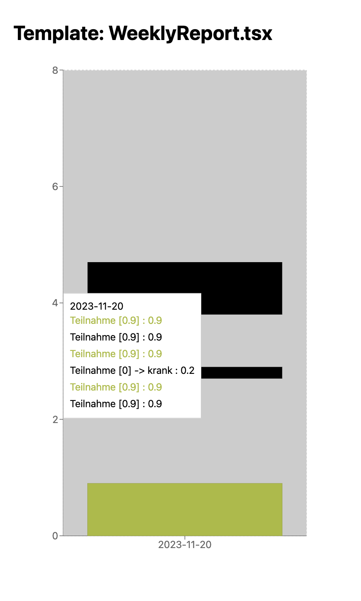

# react-rechart-test

## Issues

- [ ] Rechart stacked bars seem to break when more than 5-10 items are rendered?

Could it be due to this? Ref: https://github.com/recharts/recharts/issues/3883 - they talk about normalizing the data, but in this case the entire bar isn't missing, just segments, so it's possibly a `stackId` issue?

</img>

- [ ] 

## Workflows

```sh
# Install dependencies
pnpm install

# Start the development server
npm run dev

# Lint for TypeScript and ESLint errors
npm run lint

# Run the app in production
npm run build
npm run start
```
